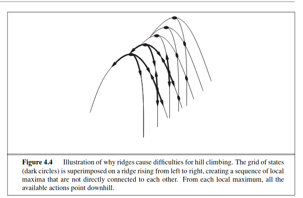
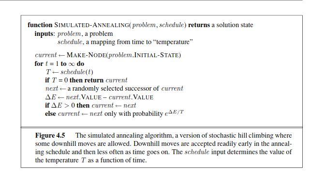
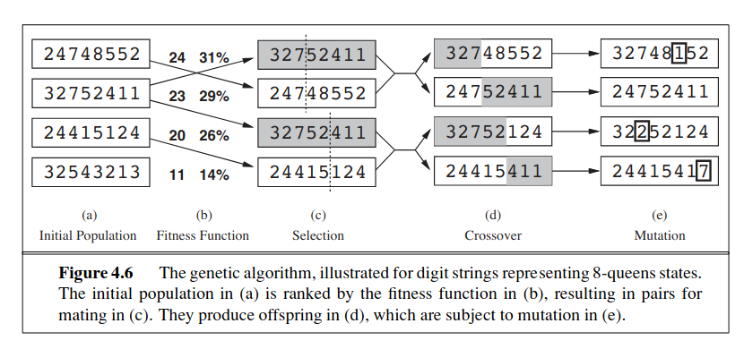
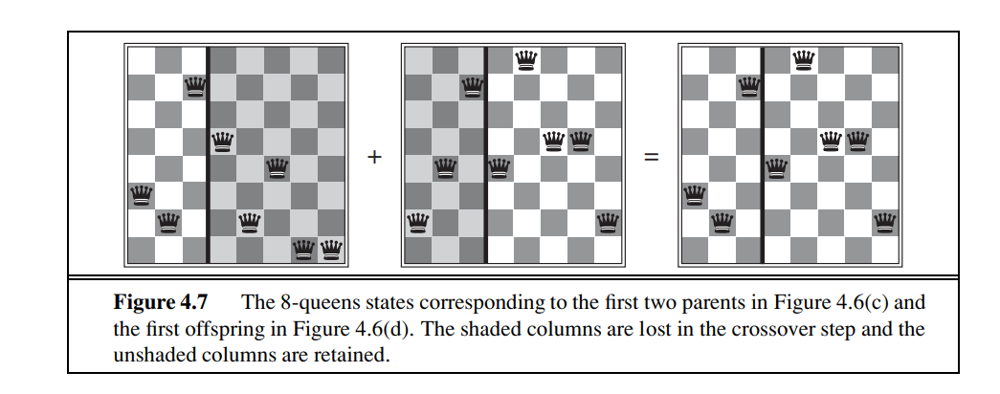

 

 
# Local Search Algorithm:

## Hill Climbing Algorithm:
- **Ridges**: Ridges result in a sequence of local maxima that is very difficult for greedy algorithms to navigate.  

- **Plateaux**:  Plateau is a flat area of the state-space landscape. It can be a flat local maximum, from which no uphill exit exists, or a shoulder, from which progress is possible. (See Figure 4.1.) A hill-climbing search might get lost on the plateau.

### Types of hill climbing:
- **Stochastic Hill Climbing:** Chooses at random from among all the uphill moves (The probability vary with the steepness of the uphill moves.)
- **First-choice Hill Climbing:** Implements the stochastic algo until the one generated is better than the current state.
- **Random-restart Hill Climbing:** Conducts a series of hill climbing searches from randomly generated initial states, until a goal is found.

**(The success of hill climbing depends very much on the shape of the state space landscape.)**  
  
## Simulated Annealing
Bad moves are more likely to be allowed at the start when T is high and they become more unlikely as T decreases. If the schedule lowers T slowly enough, the algorithm will find a global optimum with a probability approaching 1. 

## Local Beam Search
- Keeps track of k states rather than just 1.
- Begins with k randomly generated states
    - If any of them is a goal state, the algo halts.
    - At each step, all the successors of all k states are generated
- Otherwise, it selects the k best successors from the complete list and repeats. 

In random restart search, each process runs independently of the others. In a local beam search, useful info is passed among the parallel running threads. In effect, the states that generate the best successors say to the others, “Come over here, the grass is greener!” 

**Stochastic Local Beam Search:** Instead of choosing the best k from the the pool of candidate successors, stochastic beam search chooses k successors at random, with the probability of choosing a given successor being an increasing function of its value.  

## Genetic Algorithm
- A variant of Stochastic beam search.
- Successor states are generated by combining two parent states rather than modifying a single state.   
  
- Like beam searches, GA starts off with a set of k randomly generated states called the population.
- Each state or an individual is represented as a string over a finite alphabet - most commonly, a string of 0s and 1s
- Each state in the population is rated by the objective function, or (in GA terminology) the **fitness function**.
- In (c), two pairs are selected randomly for reproduction, in accordance to the probabilities in (b).
- For each pair to be mated, a crossover point is chosen randomly from the positions in the string. 
- In (d), the offspring themselves are created by crossing over the parent strings  at the crossover point  

- Finally, in (e), each location is subject to random mutation, with a small independent probablility.  
   
Like stochastic beam search, genetic algo combine an uphill tendency with random  exploration and exchange of info among parallel search threads. The primary advantage of GAs comes from the crossover operation. Yet it can be shown mathematically that, if the positions of the genetic code are permuted initailly in a random order, crossover converys no advantage.  
Intuitively the advantage comes from the ability of crossover to combine large blocks of letters that have evolved independently, thus raising the level of granularity at which the search operates.  
The theory of genetic algorithms explains how this works using the idea of a **schema**, which is a substring in which some of the positions can be left unspecified. For example, the schema 246***** describes all 8-queens states in which the first three queens are in positions 2, 4, and 6, respectively.  
Strings that match the schema (such as 24613578) are called **instances** of the schema.  
**If the average fitness of the instances of a schema is above the mean, then the number of instancesof te schema within the population will grow over time.  
(There are many variants of this selection rule. The method of culling, in which all individuals below a given threshold are discarded, can be shown to converge faster than the random version)  

