

# Knowledge and Reasoning
## Knowledge Based Agent
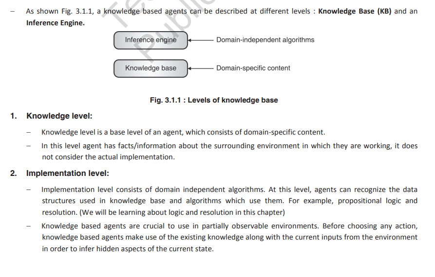

### Architecture of a KB Agent:  

1) **Knowledge Level**:
    - It is the most abstract level of agent implementation. 
    - The knowledge level describes the agent based on what it knows. This is what knowledge the agent has as the initial knowledge.
    - Basic data structures and procedures to access that knowledge are defined in this level
    - Agents at the knowledge level can be viewed as an agent for which one only need to specify what the agent knows and what its goals are in order to specify its behaviour, regardless of how it is to be implemented.  

2) #### Logical Level:
    - At the logical level, the knowledge is encoded into sentences. This level uses some formal language to represent the information it has.
    - Two types of representation techniques: Propositional Logic & First Order or Predicate Logic.

3) #### Implementation Level:
    - In implementation level, physical representation of logical level sentences is done. This level also describes data structures used in knowledge base and algorithms that are used for data manipulation.

The knowledge based agent must be able to perform following tasks:
- Represent states, actions, etc.
- Incorporate new precepts.
- Update internal representations of the world.
- Deduce hidden properties of the world.
- Deduce appropriate actions.

## The WUMPUS World Environment
#### WUMPUS is a map-based game. Let's understand the game :
- WUMPUS world is like a cave, which represents number of rooms, rooms, which are connected by passage ways. We will take a 4 X 4 grid to understand the game.
- WUMPUS is a monster who lives in one of the rooms of the cave. WUMPUS eats the player (agent) if player (agent) comes in the same room. Fig. 3.2.1 shows that room (3, 1) where WUMPUS is staying.
- Player (agent) starts from any random position in cave and has to explore the cave. We are starting from (1, 1) position.  

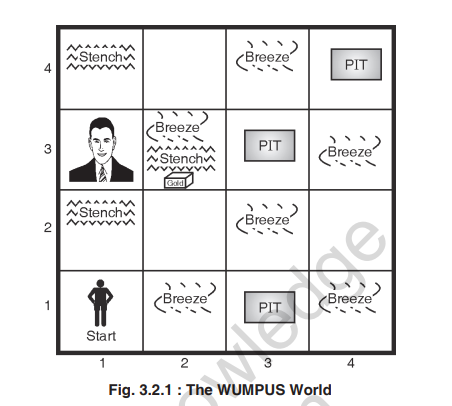
#### **There are various sprites in the game like pit, stench, breeze, gold, and arrow. Every sprite has some feature. Let's understand this one-by-one** :
- Few rooms have bottomless pits, which trap the player (agent) if he comes to that room. You can see in the Fig. 3.2.1 that room (1,3), (3,3) and (4,4) have bottomless pit. Note that even WUMPUS can fall into a pit.
- Stench experienced in a room, which has a WUMPUS in its neighbourhood room. See the Fig. 3.2.1, here room (2,1), (3,2) and (4,1) have stench.
- Breeze is experienced in a room, which has a pit in its neighbourhood room. Fig. 3.2.1 shows that room (1,2), (1,4), (2,3), (3,2), (3,4) and (4,3) consists of Breeze.
- Player (Agent) has arrows and he can shoot these arrows in straight line to kill WUMPUS.
- One of the rooms consists of gold, this room glitters. Fig.3.2.1 shows that room (3,2) has Gold.  

Apart from above features player (agent) can accept two types of percepts which are: Bump and scream. A bump is generated if player (agent) walks into a wall. While a sad scream created everywhere in the cave when the WUMPUS is killed.  

#### **Let's take a look at the actions which can be performed by the player(agent) in WUMPUS World :**
- Move : To move in forward direction,
- Turn : To turn right by 90 degrees or left by 90 degrees,
- Grab : To pick up gold if it is in the same room as the player(agent),
- Shoot : To Shoot an arrow in a straight line in the direction faced by the player (agent).  

**Goal of the game:** *Main aim of the game is that player (agent) should grab the gold and return to starting room (here its (1,1)) without being killed by the monster (WUMPUS).*  
#### Award and punishment points are assigned to a player (Agent) based on the actions it performs. Points can be given as follows:  
- 100 points are awarded if player (agent) comes out of the cave with the gold.
- 1 point is taken away for every action taken.
- 10 points are taken away if the arrow is used.
- 200 points are taken away if the player (agent) gets killed.  

### PEAS Properties of the WUMPUS World:
1) Performance Measure:
    - +100 for grabbing the gold and coming back to the starting position, 
    - \- 200 if the player(agent) is killed. 
    - \- 1 per action, 
    - \- 10 for using the arrow.
2) Environment:
    - Empty room
    - Room with WUMPUS
    - Rooms neighbouring to WUMPUS which are smelly
    - Rooms with bottomless pit.
    - Rooms neighbouring to bottomless pits which are breezy.
    - Room with gold which is glittery
    - Arrow to shoot the WUMPUS
3) Sensors:
    - Camera to get the view
    - Odour sensor to smell the stench
    - Audio sensor to listen to the scream and bump
4) Effectors:
- Motor to move left, right
- Robot arm to grab the gold
- Robot mechanism to shoot the arrow  

The WUMPUS world agent has following characteristics :
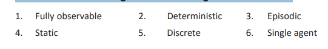  

## Logic
- Logic can be called as reasoning which is carried out or it is a review based on strict rule of validity to perform a
specified task.  
- Make a note that logic is beneficial only if the knowledge is represented in small extent and when knowledge is represented in large quantity the logic is not considered valuable.  
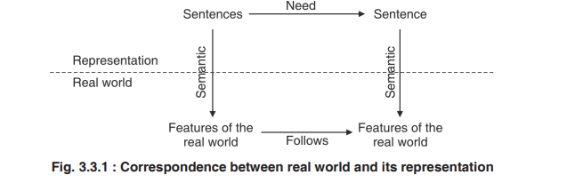  

**Role of Reasoning in AI:**  
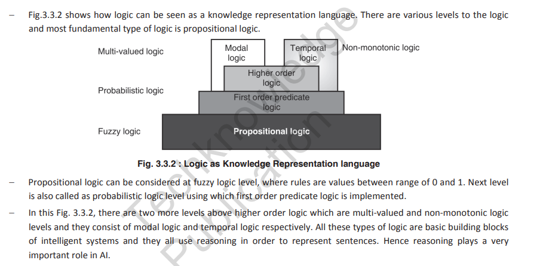  

**Representation of Knowledge usig Rules:**  
1) Logical representation:  
- The logical representations are mostly concerned with truth of statements regarding the world. These statements are
most generally represented using statements like TRUE or FALSE.
- Logic is successfully used to define ways to infer new sentences from the existing ones. There are certain logics that are used for the representation of information, and range in terms of their expressiveness. There are logic that are more expressive and are more useful in translation of sentences from natural languages into the logical ones. There are several logics that are widely used:  

    - Propositional Logic
    - First order Predicate Logic
    - Higher Order Predicate Logic
    - Fuzzy Logic
    - Other Logic

2) Production Rule Representation:
One of the widest used methods to represent knowledge is to use production rules, it is also known as IF-THEN rules.  
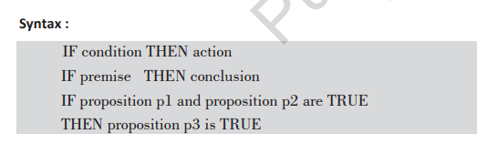  

3) Semantic Networks:
- These represent knowledge in the form of graphical networks, since graphs are easy to be stored inside programs as they are concisely represented by nodes and edges.  
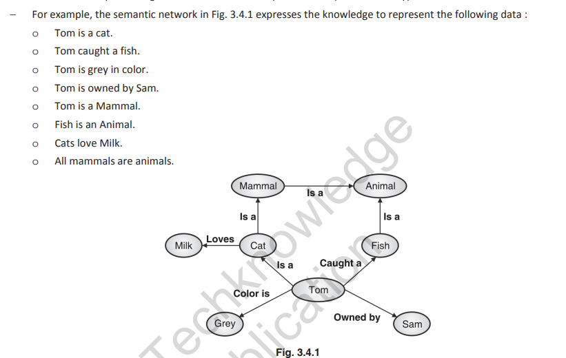
**Conceptual Graph:** It is a recent scheme used for semantic network, introduced by John Sowa, has a finite, connected, bipartite graph. The nodes represent either concepts or conceptual relations.  
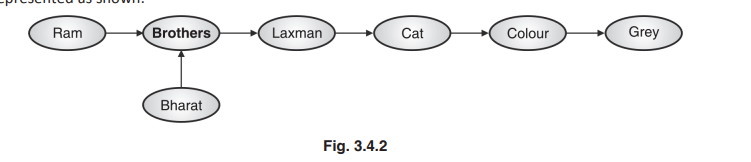

4) Frame Representation:
- Frames are record like structures that consists of a collection of slots or attributes and the corresponding slot values.
- Slots can be of any size and type. The slots have names and values called as facets.  
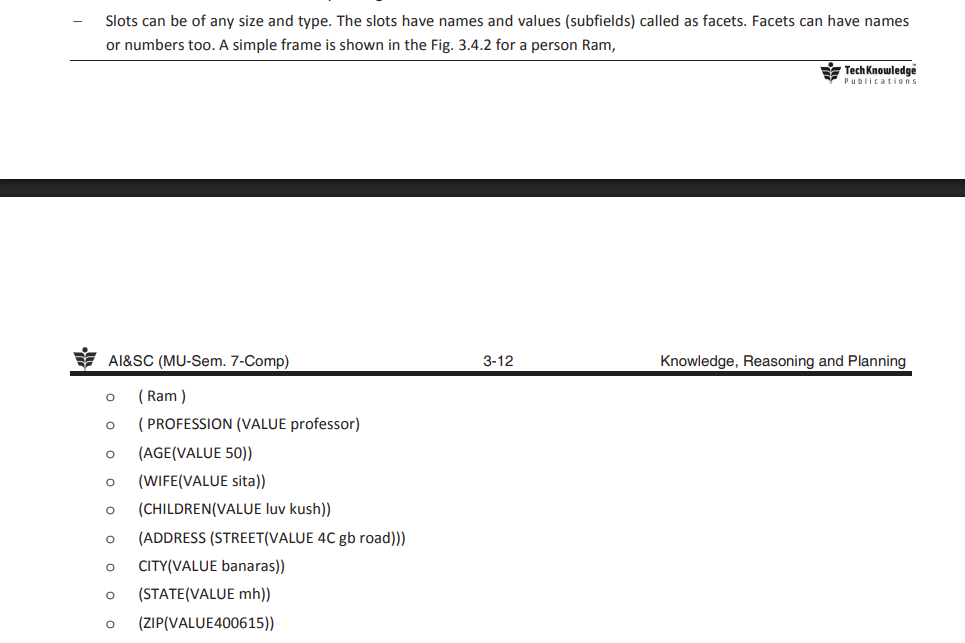  

**Ontology:**
- In AI, ontology is the specification of conceptualizations, used to help programs and humans to share knowledge about a particular domain.
- In turn, ontology is a set of concepts, like entity, relationships among entities, events that are expressed in a uniform way in order to create a vocabulary for information exchange.
- An ontology should also enable a person to verify what a symbol means. That is, given a concept, they want to be able to find the symbol, and, given the symbol, they want to be able to determine what it means.

## Propositional Logic:
- Atomic logic formulas are called propositions.
- In case of artificial intelligence propositional logic is not categorized as the study of truth values, but it is based on relativity of truth values. (i.e. The relationship between the truth value of one statement to that of the truth value of other statement)  

**Syntax**
- Propositional symbols are denoted with capital letters like: A, B, C, etc.
- Literal is an atomic sentence or it can be negation of atomic sentence. (A, ¬A)  

**Semantics**
- Semantics of a sentence is the meaning of that sentence.
- Semantics determine the interpretation of a sentence.  

**Tautology:**
- Valid sentence
- Sentence which is true for all the interpretations.

**Contradiction:**
- Inconsistent sentence.
- Sentence which is false for all interpretations.

**Inference Rules**  
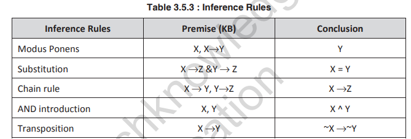  
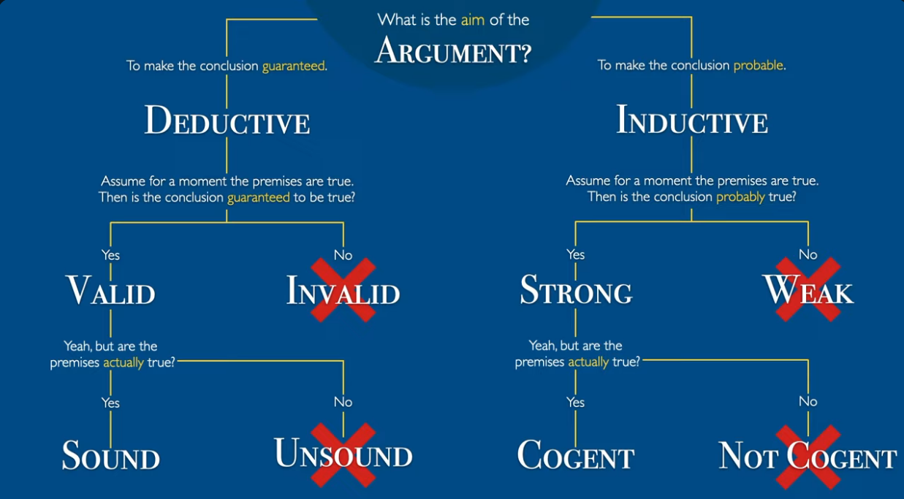  
- There are 2 types of inference rules:
1) **Sound Inference**  
Soundness property of inference says that, if “X is derived from the knowledge base” using given set of protocols of inference, then “X is entailed by knowledge base”.  
Soundness property can be represented as : “If KB |- X then KB |= X”.  
(Modus Tollens: When B is known to be false, and if there is a rule “if A, then B,” it is valid to conclude that A is also false.)
2) **Complete Inference**  
Complete inference is converse of soundness. Completeness property of inference says that, if “X is entailed by knowledge base” then “X can be derived from the knowledge base” using the inference protocols.  

**Horn Clause:**  
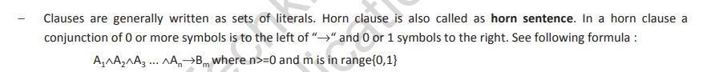  
- Horn Clauses can be used in FOL.
- Reasoning processes is simpler with horn clauses.
- Satisfiability of a propositional knowledge base is NP complete. (Satisfiability means the process of finding values for symbols which will make it true).  
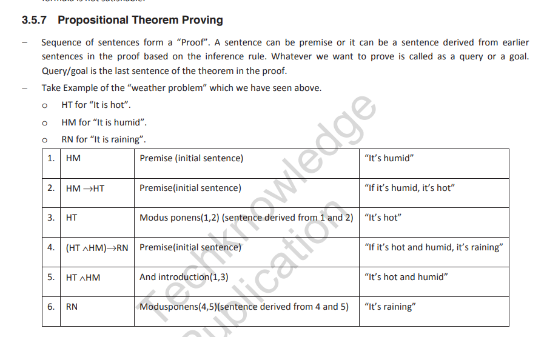  
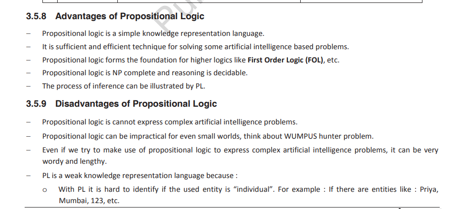  
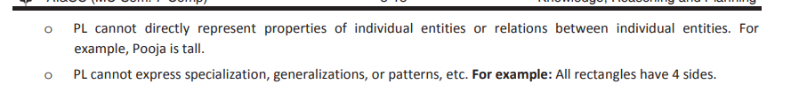  

## First Order Logic:
- More expressive than PL
- It can represent information using relations, variables and
quantifiers.

**Syntactic Elements, Semantic and Syntax:**  
1) **Constant Term:** It is a term with fixed value which belongs to the domain
2) **Variable Term:** It is a term, which can be assigned values in the domain.
3) **Function:** Say “f” is a function of “n” arguments. If we assume that t1,t2, ..,tn are terms then f(t1,t2, .., tn) is also called as a term

- First order predicate logic makes use of propositional logic as a base logic, so the connectives used in PL and FOPL are common.
- **Ground Term:** : If a term does not have any variables it is called as a ground term. A sentence in which all the variables are quantified is called as a “well-formed formula”.
    - Every ground term is mapped with an object.
    - Every condition (predicate) is mapped to a relation.
    - A ground atom is considered as true if the predicate’s relation holds between the terms’ objects.
    - Rules in FOL: In predicate logic rule has two parts predecessor and successor. If the predecessor is evaluated to TRUE successor will be true. It uses the implication **->** symbol. Rule represents If-then types of sentences.  

- **Quantifiers:**  

    1) Universal Quantifier (∀)
    2) Existential Quantifier (∃)

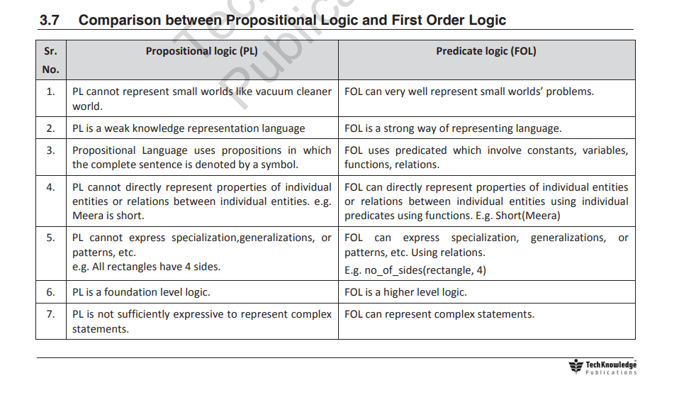
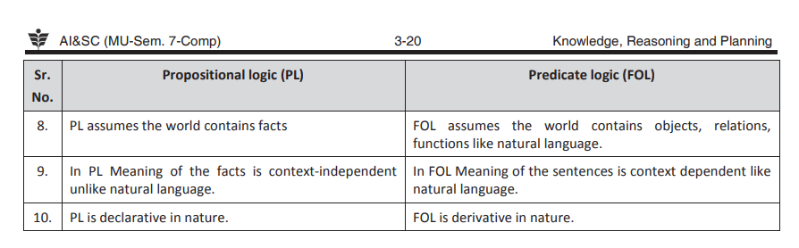

